# 📸 Plog - 个人摄影作品展示网站

<div align="center">


</div>

> 一个现代化的个人摄影作品展示网站，基于 Vue 3 + Vite 构建，支持 Live Photo、HDR 照片、EXIF 自动读取、响应式设计、深色模式。

🌐 **演示地址**: [https://zhalf.cc)

---

## 📷 界面预览

### 浅色模式

**首页**
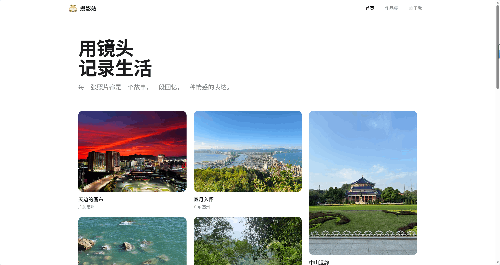

**图片详情窗**
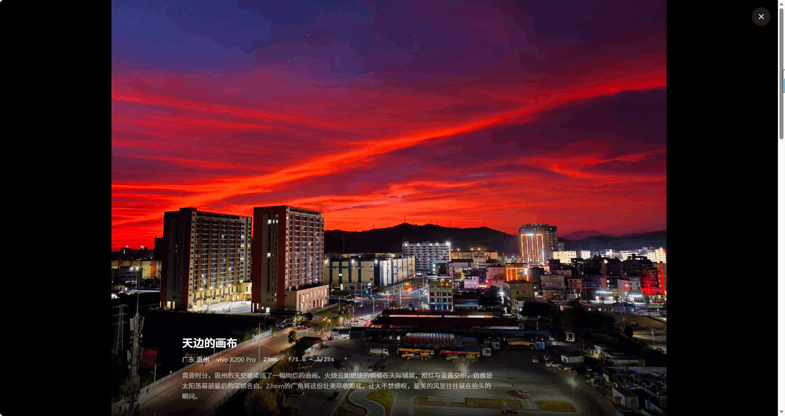

**相簿**
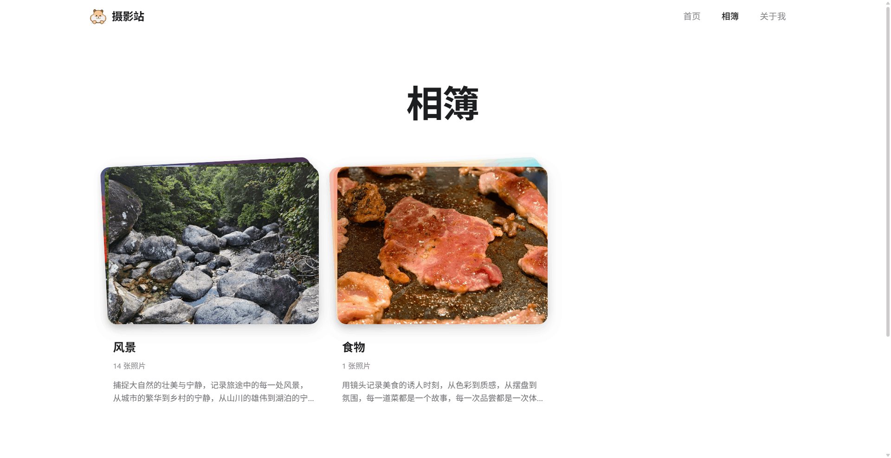

### 深色模式

**首页**
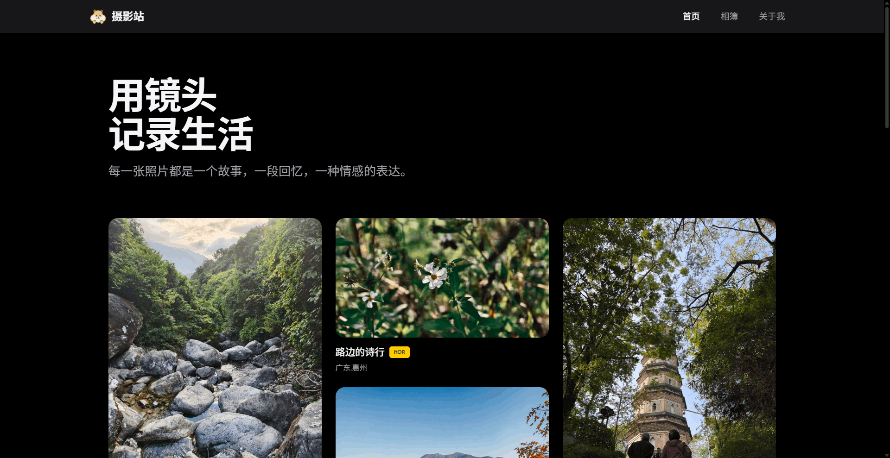

**图片详情窗**
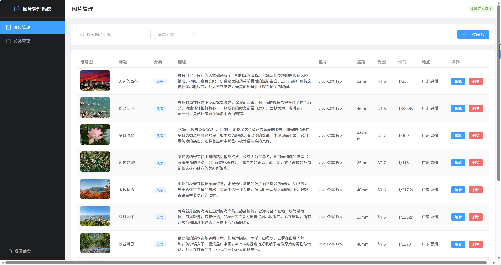

**相簿**
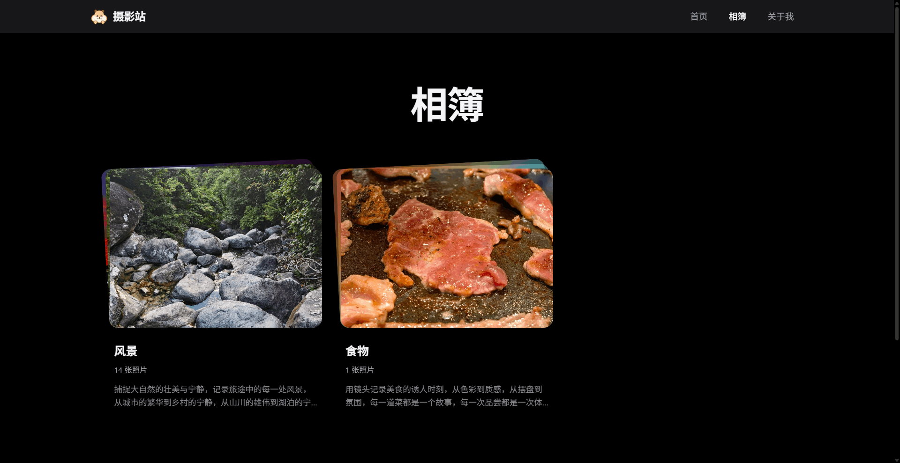

### 其他页面

**关于我**
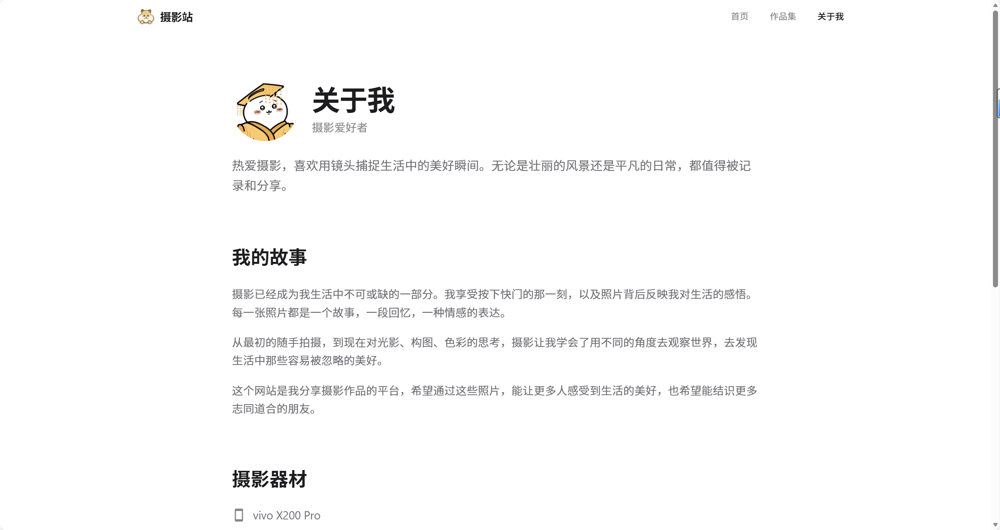

### 移动端

**首页**
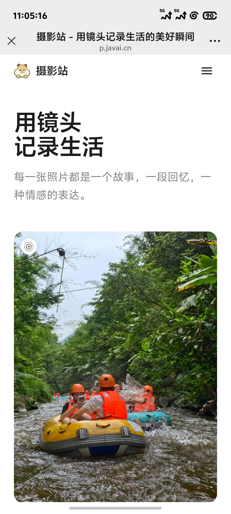

**图片详情窗**
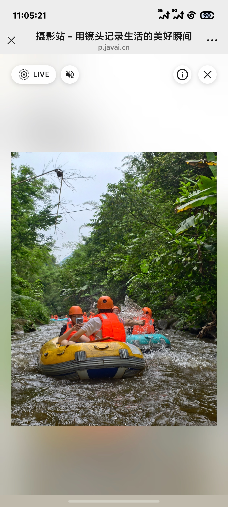

### 管理后台

**图片管理**
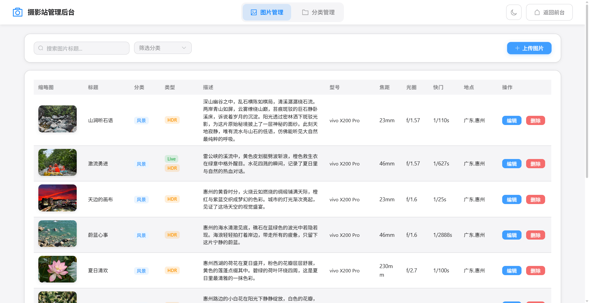

**分类管理**
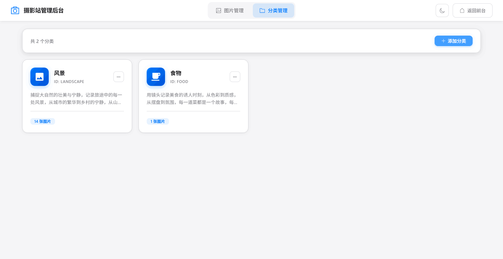

---

## 📝 最近更新

### v1.9.1 (2024-12-20)

**新增功能：**
- ✨ 全局 Toast 提示组件 - 统一的消息提示系统
- ✨ 相簿空状态提示 - 点击空相簿显示友好提示

**Bug 修复：**
- 🐛 修复相簿只有一张照片无法打开的问题
- 🐛 修复相簿空状态显示问题

**优化：**
- 🔧 浏览器兼容性提示优化 - 移除 7 天缓存，改为 3 秒自动关闭

**查看完整更新记录**: [CHANGELOG.md](CHANGELOG.md)

---

## ✨ 核心特性

### 📱 Live Photo 支持

支持 Android Motion Photo（已测试 vivo X200 Pro）：

- **自动识别和分离** - 支持多种检测方式
  - XMP 元数据检测（`vivo:LivePhoto="1"`, `GCamera:MicroVideo="1"`）
  - 二进制特征检测（兜底方案）
  - 自动提取视频并保存到 `uploads/live/`
- **HEIC 格式转换** - 自动转换为 JPG
- **交互体验**
  - PC 端：鼠标悬停 LIVE 标记循环播放
  - 移动端：点击播放一次自动停止
- **视频控制** - 静音按钮、播放状态图标
- **管理后台** - 按住预览、类型标识、视频下载
- **兼容性说明**
  - ✅ 已测试：vivo X200 Pro
  - ⚠️ 其他安卓手机（小米、OPPO、三星等）需自行测试
  - ❌ iPhone Live Photo 暂不支持

### 🌈 HDR 照片支持

使用 Gain Map 技术正确渲染 HDR 照片：

- **自动检测** - 识别 Gain Map 元数据（`Item:Semantic="GainMap"`）
- **WebGL 渲染** - 高亮度图像渲染（基于 gainmap-js）
- **元数据保留** - 上传时保留完整 HDR 信息
- **标识显示** - 金色 HDR 徽章
- **兼容性说明**
  - ✅ 已测试：vivo X200 Pro
  - ⚠️ 其他安卓手机需自行测试
  - ❌ iPhone HDR 暂不支持

### 🎨 文件夹式 3D 相册

Apple 风格的相册展示：

- **3D 层叠效果** - 3 层照片露出，营造文件夹感
- **悬停动画** - 后层展开 + 旋转，模拟"打开"效果
- **两种显示模式** - 通过 `galleryConfig.albumLayerMode` 配置
  - `'color'` - 虚拟彩色（彩虹渐变色卡）
  - `'photo'` - 真实照片（显示相册内第 2、3 张照片）
- **直接浏览** - 点击相册直接打开照片弹窗

### 🖼️ 液态玻璃照片弹窗

Apple 风格的照片查看器：

- **单张/多张模式** - 自动适配
- **液态玻璃导航栏** - 底部缩略图导航
  - 增强模糊效果（60px blur + 200% 饱和度）
  - 渐变背景 + 多层阴影
  - 玻璃高光效果
- **多种滚动方式**
  - 鼠标滚轮：垂直转横向（0.8 倍速）
  - 触摸板：双指左右滑动
  - 鼠标拖动：grab/grabbing 光标
  - 触摸屏：手指左右滑动
- **流畅切换动画** - 方向性滑动 + 淡入淡出
- **键盘导航** - 左右箭头切换 / ESC 关闭
- **移动端优化** - 手势滑动 + 详情面板覆盖


### 🎭 Apple 风格交互系统

统一的交互设计语言（`src/styles/interactions.css`）：

- **按钮交互**
  - hover：上移 + 阴影增强
  - active：缩放 0.95 + 快速反馈
  - 图标按钮：放大 1.1 + 背景扩散
- **卡片交互**
  - hover：上移 4px + 放大 1.005
  - active：缩放 0.98
  - 过渡时间：350ms
- **链接交互**
  - 下划线动画：从中间向两边展开
  - 导航链接：底部细线动画
- **标签交互**
  - hover：放大 1.05 + 轻微阴影
  - 涟漪效果：点击扩散动画
- **移动端优化**
  - 移除 hover 效果
  - 增强 active 反馈
  - 禁用点击高亮

### 🌓 深色模式

完整的深色模式支持：

- **自动跟随系统** - 使用 `prefers-color-scheme`
- **CSS 变量系统** - 统一管理颜色
  - `--bg-primary` / `--bg-secondary`
  - `--text-primary` / `--text-secondary` / `--text-tertiary`
  - `--border-color` / `--nav-bg`
- **所有组件适配** - 导航栏、卡片、弹窗、表单等
- **阴影自适应** - 深色模式下阴影更深

### 📊 EXIF 信息管理

完整的照片元数据处理：

- **自动提取** - 使用 exifr 库
  - 相机型号（Make + Model）
  - 焦距（FocalLength）
  - 光圈（FNumber）
  - 快门速度（ExposureTime）
  - ISO（ISO）
  - 拍摄时间（DateTimeOriginal）
- **GPS 逆地理编码** - 高德地图 API
  - 自动转换为省市地址
  - 格式：`广东省.惠州市.惠城区`
- **表单自动填充** - 上传时自动填入 EXIF 信息
- **详情展示** - 照片弹窗中展示完整信息

### 🛠️ 管理后台

Apple 液态玻璃风格的管理系统：

- **图片上传** - 按钮式上传，支持预览，Live Photo 预览（按住播放），HDR 照片标识，EXIF 信息卡片式展示
- **自动处理** - 生成 800px 缩略图，保留 HDR 元数据，提取 Live Photo 视频，HEIC 转 JPG
- **图片管理** - 列表展示（Live/HDR 标签），编辑标题、分类、描述，删除同步清理文件
- **分类管理** - 添加、编辑、删除分类，图标、描述配置
- **批量检测脚本** - `npm run detect` 自动检测所有照片特性

### 🔍 SEO 优化

- **动态 Meta 标签** - 每个页面独立的标题、描述、关键词
- **Open Graph** - 社交分享优化
- **结构化数据** - JSON-LD 支持
- **自动生成** - robots.txt 和 sitemap.xml

### 🚀 性能优化

- **图片懒加载** - 延迟加载 + 骨架屏
- **路由懒加载** - 按需加载页面
- **缩略图分离** - 列表用小图，详情用原图
- **图片尺寸预留** - 避免布局跳动
- **代码分割** - 管理后台独立打包

---

## 🏗️ 技术栈

| 技术 | 版本 | 说明 |
|-----|------|------|
| Vue | 3.4+ | 前端框架 |
| Vite | 5.2+ | 构建工具 |
| Vue Router | 4.x | 路由管理 |
| Tailwind CSS | 3.4+ | CSS 框架 |
| Element Plus | 2.x | 管理后台 UI |
| @iconify/vue | 5.x | 图标库 |
| Express | 4.x | 后端服务 |
| Sharp | 0.34+ | 图片处理 |
| exifr | 7.x | EXIF 读取 |
| @monogrid/gainmap-js | 3.x | HDR Gain Map 渲染 |
| heic2any | 0.0.4 | HEIC 转 JPG |

---

## 📦 项目结构

```
plog/
├── public/                     # 静态资源
│   ├── logo.png               # 网站 Logo
│   ├── avatar.png             # 头像
│   ├── robots.txt             # 爬虫规则（自动生成）
│   └── sitemap.xml            # 站点地图（自动生成）
│
├── src/
│   ├── components/            # 公共组件
│   │   ├── HeaderNav.vue      # 顶部导航（毛玻璃 + 移动端菜单）
│   │   ├── FooterSection.vue  # 页脚（版本号 + 访问统计）
│   │   ├── PhotoModal.vue     # 照片弹窗（单张/多张模式）
│   │   ├── LivePhotoCard.vue  # Live Photo 卡片
│   │   ├── HDRImageViewer.vue # HDR 图片查看器
│   │   ├── LazyImage.vue      # 懒加载图片
│   │   ├── BrowserToast.vue   # 浏览器兼容性提示
│   │   ├── BusuanziStats.vue  # 访问统计
│   │   └── BackToTop.vue      # 回到顶部
│   │
│   ├── views/                 # 页面视图
│   │   ├── Home/              # 首页（瀑布流）
│   │   ├── Gallery/           # 作品集（3D 相册）
│   │   ├── About/             # 关于我（交互优化）
│   │   ├── Admin/             # 管理后台
│   │   │   ├── index.vue      # 后台首页
│   │   │   ├── PhotosManager.vue      # 图片管理
│   │   │   ├── CategoriesManager.vue  # 分类管理
│   │   │   └── LivePhotoUpload.vue    # Live Photo 上传
│   │   └── NotFound/          # 404 页面
│   │
│   ├── config/                # 配置文件
│   │   └── index.js           # 统一配置（站点、页面、相册）
│   │
│   ├── data/                  # 数据文件
│   │   └── photos.js          # 照片和分类数据
│   │
│   ├── utils/                 # 工具函数
│   │   ├── photoProcessors/   # 照片处理器（策略模式）
│   │   │   ├── BasePhotoProcessor.js
│   │   │   ├── IPhoneLivePhotoProcessor.js
│   │   │   ├── GoogleMotionPhotoProcessor.js
│   │   │   ├── VivoMotionPhotoProcessor.js
│   │   │   ├── HDRPhotoProcessor.js
│   │   │   └── NormalPhotoProcessor.js
│   │   ├── colorExtractor.js  # 颜色提取
│   │   ├── livePhoto.js       # Live Photo 工具
│   │   └── videoCodec.js      # 视频编解码
│   │
│   ├── composables/           # 组合式函数
│   │   └── useSEO.js          # SEO 工具
│   │
│   ├── styles/                # 样式文件
│   │   └── interactions.css   # 交互样式系统
│   │
│   ├── router/                # 路由配置
│   ├── App.vue                # 根组件
│   ├── main.js                # 入口文件
│   └── style.css              # 全局样式（含深色模式变量）
│
├── admin-server/              # 管理后台服务
│   ├── index.js               # Express 服务
│   ├── .env                   # 环境变量（API Key）
│   ├── .env.example           # 环境变量示例
│   └── package.json
│
├── uploads/                   # 上传的图片
│   ├── original/              # 原图
│   ├── thumbnail/             # 缩略图（800px）
│   └── live/                  # Live Photo 视频
│
├── scripts/                   # 工具脚本
│   ├── dev.js                 # 同时启动前后端
│   ├── generateSeoFiles.js    # 生成 SEO 文件
│   ├── updateImageDimensions.js # 批量更新图片尺寸
│   ├── detectPhotoFeatures.js # 批量检测 HDR 和 Live Photo
│   └── optimizeThumbnails.js  # 优化缩略图
│
├── docs/images/               # 文档图片
├── index.html                 # HTML 模板
├── vite.config.js             # Vite 配置
├── tailwind.config.js         # Tailwind 配置
├── postcss.config.js          # PostCSS 配置
├── deploy.sh                  # 部署脚本
├── CHANGELOG.md               # 更新日志
└── package.json
```


---

## ⚙️ 配置说明

所有配置集中在 `src/config/index.js`，方便统一管理。

### 站点配置 (siteConfig)

```javascript
export const siteConfig = {
  name: '摄影站',                           // 网站名称
  startYear: 2025,                          // 建站年份（页脚显示）
  domain: 'https://p.javai.cn',             // 网站域名（SEO 用）
  description: '用镜头记录生活的美好瞬间...', // 网站描述（SEO）
  keywords: '摄影,个人摄影,生活记录...',      // 关键词（SEO）
  logo: '/logo.png',                        // Logo 路径
  icp: '',                                  // ICP 备案号（可选，留空不显示）
}
```

### EXIF 配置 (exifConfig)

```javascript
export const exifConfig = {
  enabled: true,  // 是否启用 EXIF 读取
}
```

**高德地图 API Key** 配置在 `admin-server/.env`：

```bash
AMAP_API_KEY=your-api-key-here
```

申请地址: https://console.amap.com/dev/key/app

### 相册配置 (galleryConfig)

```javascript
export const galleryConfig = {
  /**
   * 相册文件夹层叠效果的显示模式
   * 
   * 可选值：
   * - 'photo': 真实照片显示（显示相册中第 2、3 张照片作为层叠效果）
   * - 'color': 虚拟彩色显示（使用彩虹渐变色作为层叠效果）
   * 
   * 说明：
   * - 'photo' 模式：更真实的文件夹效果，用户能预览相册内容
   *   - 如果相册少于 3 张图片，不足的层会使用彩虹渐变填充
   * - 'color' 模式：简洁的彩色渐变效果，性能最优
   * 
   * 注意：
   * - 'photo' 模式需要加载更多图片，网络较慢时可能有延迟
   */
  albumLayerMode: 'photo',
}
```

### 页面配置 (pageConfig)

#### 关于我页面

```javascript
export const pageConfig = {
  about: {
    title: '关于我',
    avatar: '/avatar.png',
    nickname: '摄影爱好者',
    bio: '热爱摄影，喜欢用镜头捕捉生活中的美好瞬间...',
    
    // 我的故事（支持多段落）
    story: [
      '第一段故事...',
      '第二段故事...',
      '第三段故事...',
    ],
    
    // 摄影器材
    equipment: [
      { type: '手机', name: 'vivo X200 Pro' },
      { type: '手机', name: 'Apple iPhone 15' },
      { type: '相机', name: 'Sony A7M4' },  // type 可以是 '手机' 或 '相机'
    ],
  },
  
  // 联系方式（留空则不显示）
  contact: {
    email: 'your@email.com',                    // 邮箱
    github: 'https://github.com/username',      // GitHub
    wechat: '',                                 // 微信二维码图片链接
    weibo: '',                                  // 微博主页链接
    xiaohongshu: '',                            // 小红书主页链接
    douyin: '',                                 // 抖音主页链接
    bilibili: '',                               // B站主页链接
    qq: '',                                     // QQ 号或 QQ 群链接
  },
}
```

**拍摄足迹** 会自动从照片数据中提取省市级别位置，无需手动配置。

---

## 🚀 快速开始

### 环境要求

- Node.js >= 16.0.0
- npm >= 7.0.0
- **推荐使用 Chrome 浏览器**访问管理后台

### 安装

```bash
# 克隆项目
git clone https://github.com/lyhxx/photography-station.git
cd photography-station

# 安装前端依赖
npm install

# 安装后端依赖
cd admin-server
npm install
cd ..
```

### 配置

#### 1. 配置高德地图 API（可选，用于 GPS 逆地理编码）

```bash
# 复制示例文件
cp admin-server/.env.example admin-server/.env

# 编辑 .env 文件，填入你的 API Key
AMAP_API_KEY=your-api-key-here
```

申请地址: https://console.amap.com/dev/key/app

#### 2. 修改站点配置

编辑 `src/config/index.js`，修改站点信息：

```javascript
export const siteConfig = {
  name: '你的网站名称',
  domain: 'https://your-domain.com',
  description: '你的网站描述',
  // ... 其他配置
}
```

### 开发

```bash
# 启动开发服务（前端 + 后端）
npm run dev

# 或分别启动
npm run dev:frontend  # 前端: http://localhost:3000
npm run dev:backend   # 后端: http://localhost:3001
```

访问：
- 前台：http://localhost:3000
- 管理后台：http://localhost:3000/admin

### 构建

```bash
# 构建生产版本（自动生成 SEO 文件 + 复制 uploads 文件夹）
npm run build

# 预览构建结果
npm run preview
```

构建完成后，`dist` 目录包含：
- 所有前端资源（HTML、CSS、JS）
- `uploads` 文件夹（原图、缩略图、视频）
- SEO 文件（robots.txt、sitemap.xml）

---

## 📝 使用指南

### 添加照片

1. 启动开发服务：`npm run dev`
2. 访问管理后台：`http://localhost:3000/admin`
3. 点击「上传图片」按钮
4. 选择图片文件（支持 JPG、PNG、HEIC、Live Photo）
5. 填写标题、选择分类、添加描述
6. 点击「确认上传」

**上传时会自动：**
- 生成 800px 缩略图
- 读取 EXIF 信息（相机、焦距、光圈、快门、ISO）
- 转换 GPS 为省市地址（需配置高德地图 API）
- 记录图片尺寸（用于懒加载占位）
- 检测 Live Photo 并提取视频
- 检测 HDR 照片并保留元数据
- HEIC 格式自动转换为 JPG

### 管理分类

在管理后台的「分类管理」标签页中：

1. **添加分类**
   - 点击「添加分类」
   - 填写分类名称
   - 选择图标（Iconify 图标名称，如 `mdi:camera`）
   - 填写描述（可选）
   - 点击「确认」

2. **编辑分类**
   - 点击分类行的「编辑」按钮
   - 修改信息
   - 点击「确认」

3. **删除分类**
   - 点击分类行的「删除」按钮
   - 确认删除

### 编辑照片

1. 在「图片管理」标签页找到要编辑的照片
2. 点击「编辑」按钮
3. 修改标题、分类、描述、EXIF 信息
4. 点击「确认」

### 删除照片

1. 在「图片管理」标签页找到要删除的照片
2. 点击「删除」按钮
3. 确认删除

**删除时会同步清理：**
- 原图文件
- 缩略图文件
- Live Photo 视频文件（如果有）

### 批量检测照片特性

如果有旧照片需要检测 HDR 和 Live Photo 特性：

```bash
npm run detect
```

脚本会：
- 扫描 `uploads/original/` 目录
- 检测每张照片的 HDR 和 Live Photo 特性
- 更新 `src/data/photos.js` 数据
- 提取 Live Photo 视频到 `uploads/live/`

### 批量更新图片尺寸

如果有旧图片没有尺寸信息：

```bash
node scripts/updateImageDimensions.js
```

---

## 🔧 脚本命令

| 命令 | 说明 |
|-----|------|
| `npm run dev` | 启动开发服务（前端+后端） |
| `npm run dev:frontend` | 仅启动前端（Vite） |
| `npm run dev:backend` | 仅启动后端（Express） |
| `npm run build` | 构建生产版本 |
| `npm run build:seo` | 生成 SEO 文件 |
| `npm run preview` | 预览构建结果 |
| `npm run detect` | 批量检测照片的 HDR 和 Live Photo 特性 |

---

## 🌐 部署

### 方式一：腾讯云 EdgeOne 静态托管（推荐）

推荐使用 [腾讯云 EdgeOne](https://edgeone.ai/) 进行静态托管，享受全球 CDN 加速。

**优势：**
- 🚀 全球 CDN 加速，访问速度快
- 💰 免费额度充足，个人项目零成本
- 🔒 自动 HTTPS 证书
- 🌍 智能路由，国内外访问优化
- 📊 实时监控和日志分析

**部署步骤：**

1. 构建项目
```bash
npm run build
```

2. 登录 [EdgeOne 控制台](https://console.cloud.tencent.com/edgeone)

3. 创建站点并绑定域名

4. 上传 `dist` 目录到静态托管

5. 配置完成，自动部署

**构建配置：**
- 构建命令：`npm run build`
- 输出目录：`dist`
- Node 版本：16.x 或更高

**特点：**
- 打包时自动将 `uploads` 文件夹复制到 `dist` 目录
- 无需额外配置，开箱即用
- 适合纯静态部署

**其他平台：** 也支持 Vercel、Netlify、Cloudflare Pages 等静态托管平台

### 方式二：自动部署脚本

项目提供了 `deploy.sh` 自动部署脚本，支持一键拉取代码、安装依赖、构建项目。

**部署后的目录结构：**
```
/www/wwwroot/p.javai.cn/
├── deploy.sh                      # 部署脚本
├── dist/                          # 构建产物（Nginx 指向这里）
│   └── uploads/                   # 图片目录（自动复制）
└── photography_station/           # 代码仓库
```

**使用方法：**
```bash
# 首次部署
chmod +x deploy.sh
./deploy.sh

# 后续更新
./deploy.sh
```

### Nginx 配置示例

```nginx
server {
    listen 80;
    server_name your-domain.com;
    root /www/wwwroot/p.javai.cn/dist;
    index index.html;

    # Gzip 压缩
    gzip on;
    gzip_types text/css application/javascript image/svg+xml application/json;
    gzip_min_length 1000;

    # 静态资源缓存
    location ~* \.(js|css|png|jpg|jpeg|webp|gif|ico|svg|woff|woff2|ttf|eot)$ {
        expires 1y;
        add_header Cache-Control "public, immutable";
    }

    # HTML 文件不缓存
    location ~* \.html$ {
        add_header Cache-Control "no-cache, no-store, must-revalidate";
    }

    # SPA 路由
    location / {
        try_files $uri $uri/ /index.html;
    }
}
```

### 注意事项

- **管理后台仅支持本地使用**，不支持远程部署
  - 后端服务 (`admin-server`) 设计为本地开发使用
  - 生产环境管理后台路由自动禁用，无法访问 `/admin`
  - 建议在本地管理照片，然后部署到服务器
- 建议使用 CDN 存储图片
- 定期备份 `uploads/` 和 `src/data/photos.js`

---

## 🌐 浏览器兼容性

### 推荐浏览器

- ✅ **Chrome 90+** (推荐，最佳体验)
- ✅ Safari 14+
- ⚠️ Edge 90+ (Live Photo 预览可能不可用)
- ⚠️ Firefox 88+ (Live Photo 预览可能不可用)

### 说明

- **前台展示**在所有现代浏览器中都能正常工作
- **管理后台**会自动检测浏览器并显示兼容性提示
- **Live Photo 预览**功能在 Edge/Firefox 可能无法正常工作，推荐使用 Chrome
- 预览失败不影响上传，前台展示正常
- 可以使用"下载视频"按钮在本地播放器中测试视频

---

## ❓ 常见问题

<details>
<summary><b>Q: Live Photo 上传后不显示怎么办？</b></summary>

**A:** 请检查以下几点：
1. 确认照片是 vivo 手机拍摄的 Live Photo（目前只支持 vivo）
2. 运行 `npm run detect` 批量检测照片特性
3. 检查 `uploads/live/` 目录是否有对应的视频文件
4. 查看浏览器控制台是否有错误信息
5. 确认使用 Chrome 浏览器（Edge/Firefox 可能不支持）

</details>

<details>
<summary><b>Q: 如何修改网站配色和样式？</b></summary>

**A:** 
1. **全局配色**：编辑 `src/style.css` 中的 CSS 变量
   ```css
   :root {
     --bg-primary: #ffffff;
     --text-primary: #1d1d1f;
     /* 修改这些变量 */
   }
   ```

2. **后台配色**：编辑 `src/styles/admin.css` 中的 CSS 变量

3. **站点信息**：编辑 `src/config/index.js` 中的 `siteConfig`

</details>

<details>
<summary><b>Q: 生产环境如何使用管理后台？</b></summary>

**A:** 
管理后台仅设计为本地使用，不支持远程部署。原因：

1. 后端服务 (`admin-server`) 是简单的 Express 服务，没有身份验证
2. 直接操作本地文件系统，不适合生产环境
3. 生产环境路由已自动禁用

**推荐工作流程：**
1. 本地启动开发服务：`npm run dev`
2. 访问 `http://localhost:3000/admin` 管理照片
3. 修改完成后提交代码或重新构建部署

**如果确实需要远程管理：**
- 需要重新设计后端架构（添加身份验证、数据库、文件上传服务等）
- 建议使用专业的 CMS 系统或对象存储服务

</details>

<details>
<summary><b>Q: 图片太多加载慢怎么办？</b></summary>

**A:** 
1. **使用 CDN**：将 `uploads` 目录托管到 CDN（如腾讯云 COS）
2. **优化缩略图**：运行 `node scripts/optimizeThumbnails.js`
3. **懒加载**：项目已内置懒加载，确保图片有正确的宽高信息
4. **分页加载**：可以考虑在首页添加分页或无限滚动

</details>

<details>
<summary><b>Q: 如何添加新的照片分类？</b></summary>

**A:** 
1. 访问管理后台 `http://localhost:3000/admin`
2. 切换到「分类管理」标签
3. 点击「添加分类」按钮
4. 填写分类名称、图标（Iconify 图标名）、描述
5. 图标可以在 [Iconify](https://icon-sets.iconify.design/) 搜索

</details>

<details>
<summary><b>Q: HDR 照片显示不正常怎么办？</b></summary>

**A:** 
1. 确认照片是 vivo X200 Pro 等支持 Gain Map 的设备拍摄
2. 检查浏览器是否支持 WebGL（Chrome/Safari 支持较好）
3. 查看控制台是否有 gainmap-js 相关错误
4. 确认上传时保留了元数据（Sharp 的 `withMetadata()` 选项）

</details>

<details>
<summary><b>Q: 如何备份照片数据？</b></summary>

**A:** 
需要备份以下内容：
1. `uploads/` 目录（所有图片和视频）
2. `src/data/photos.js`（照片元数据）
3. `src/config/index.js`（站点配置）

建议定期备份到云存储或 Git 仓库。

</details>

---

## 🎯 开发计划

### 已完成 ✅

- [x] Android Live Photo 支持（vivo X200 Pro 已测试）
- [x] Android HDR 照片渲染（vivo X200 Pro 已测试）
- [x] 文件夹式 3D 相册
- [x] 液态玻璃照片弹窗
- [x] Apple 风格交互系统
- [x] 深色模式
- [x] 移动端优化
- [x] EXIF 信息管理
- [x] 浏览器兼容性提示
- [x] 后台管理系统（Apple 液态玻璃风格）

### 计划中 📋

- [ ] iPhone Live Photo 支持
- [ ] iPhone HDR 照片支持
- [ ] 多语言支持
- [ ] 评论系统
- [ ] PWA 支持

**查看详细更新记录**: [CHANGELOG.md](CHANGELOG.md)

---

## 📄 开源协议

MIT License

---

## 🤝 贡献

欢迎提交 Issue 和 Pull Request！

### 贡献指南

1. Fork 本仓库
2. 创建特性分支 (`git checkout -b feature/AmazingFeature`)
3. 提交更改 (`git commit -m 'Add some AmazingFeature'`)
4. 推送到分支 (`git push origin feature/AmazingFeature`)
5. 提交 Pull Request

---

## 📮 联系

- 邮箱: xihons@qq.com
- GitHub: [@lyhxx](https://github.com/lyhxx)
- 网站: [https://p.javai.cn/](https://p.javai.cn/)

---

## 🙏 致谢

感谢以下开源项目：

- [Vue.js](https://vuejs.org/) - 渐进式 JavaScript 框架
- [Vite](https://vitejs.dev/) - 下一代前端构建工具
- [Tailwind CSS](https://tailwindcss.com/) - 实用优先的 CSS 框架
- [Element Plus](https://element-plus.org/) - Vue 3 组件库
- [Iconify](https://iconify.design/) - 统一的图标框架
- [Sharp](https://sharp.pixelplumbing.com/) - 高性能图片处理库
- [gainmap-js](https://github.com/MONOGRID/gainmap-js) - HDR Gain Map 渲染

---

## 📊 Star 历史

[](https://star-history.com/#lyhxx/photography-station&Date)

---

<div align="center">

**用镜头记录生活，用代码分享美好** 📸

Made with ❤️ by [lyhxx](https://github.com/lyhxx)

⭐ 如果这个项目对你有帮助，请给个 Star！

</div>
