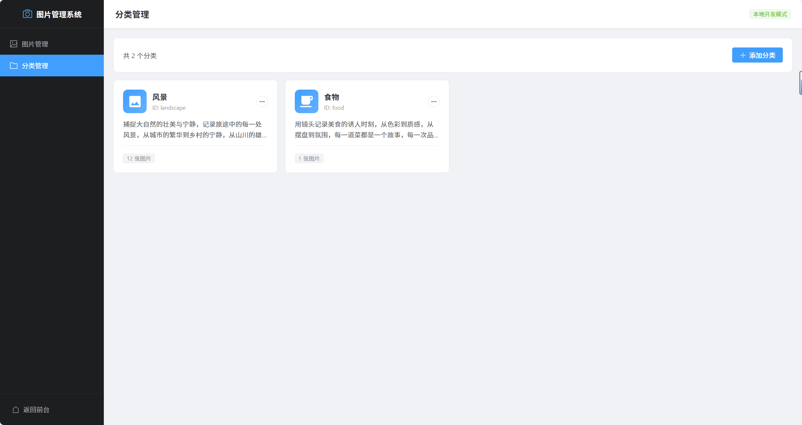

# 📸 Plog - 个人摄影作品展示网站

> 一个现代化的个人摄影作品展示网站，基于 Vue 3 + Vite 构建，支持本地图片管理、EXIF 自动读取、响应式设计、深色模式。

🌐 **演示地址**: [https://p.javai.cn/](https://p.javai.cn/)

---

## 📷 界面预览

### 前台展示

**首页**


**图片弹窗**


**作品集**


**关于我**


**深色模式**


### 管理后台

**图片管理**


**图片新增**


**分类管理**


---

## ✨ 功能特色

### 🏠 首页
- 瀑布流照片墙布局
- 照片标题、拍摄地点显示
- 点击照片打开详情弹窗
- 图片懒加载 + 骨架屏动画

### 🎨 作品集 
- 分类筛选标签
- 瀑布流布局，适配不同尺寸图片
- 照片数量、拍摄地点统计
- 点击照片打开详情弹窗

### 📷 照片弹窗
- 高清原图查看
- EXIF 信息展示（相机型号、焦距、光圈、快门速度）
- 拍摄地点显示
- 照片描述文字
- ESC 键关闭弹窗

### 👤 关于我
- 个人头像、昵称、简介
- 我的故事（多段落支持）
- 摄影器材展示
- 拍摄足迹（自动从照片数据提取省市）
- 联系方式 / 社交链接

### 🎨 界面设计
- **Apple 风格** - 简约大气的视觉设计
- **深色模式** - 自动跟随系统主题切换
- **响应式布局** - 完美适配 PC / 平板 / 手机
- **流畅动画** - 精心设计的交互动效
- **毛玻璃导航栏** - 滚动时阴影变化
- **移动端菜单** - 汉堡菜单适配小屏幕

### 🛠️ 管理后台
- **图片上传** - 拖拽上传，支持预览
- **自动缩略图** - 上传时自动生成 800px 缩略图
- **EXIF 自动读取** - 提取相机型号、焦距、光圈、快门
- **GPS 逆地理编码** - 自动转换为省市地址（高德地图 API）
- **图片编辑** - 修改标题、分类、描述、EXIF 信息
- **图片删除** - 同步删除原图和缩略图文件
- **分类管理** - 添加、编辑、删除分类

### 🔍 SEO 优化
- 动态 Meta 标签（标题、描述、关键词）
- Open Graph 标签（社交分享优化）
- 结构化数据（JSON-LD）
- 自动生成 robots.txt 和 sitemap.xml
- Canonical URL 规范链接

### ⚙️ 配置化管理
- 站点名称、Logo、域名
- SEO 配置（标题后缀、描述、关键词）
- 页面内容配置（首页标题、关于我信息等）
- 社交链接配置（邮箱、GitHub、微信等）
- ICP 备案号（可选）

### 🚀 性能优化
- 图片懒加载 + 骨架屏
- 路由懒加载（按需加载页面）
- 缩略图分离（列表用小图，详情用原图）
- 图片尺寸预留（避免布局跳动）

### 🔒 安全
- 生产环境自动禁用管理后台路由
- API Key 存储在后端环境变量（不暴露到前端）

### 📊 其他功能
- **访问统计** - 不蒜子统计（今日访问、总访问）
- **404 页面** - 可爱的 404 页面，带动画效果
- **回到顶部** - 滚动后显示回到顶部按钮

---

## 🏗️ 技术栈

| 技术 | 版本 | 说明 |
|-----|------|------|
| Vue | 3.4+ | 前端框架 |
| Vite | 5.2+ | 构建工具 |
| Vue Router | 4.x | 路由管理 |
| Tailwind CSS | 3.4+ | CSS 框架 |
| Element Plus | 2.x | 管理后台 UI |
| Express | 4.x | 后端服务 |
| Sharp | 0.34+ | 图片处理 |
| exifr | 7.x | EXIF 读取 |

---

## 📦 项目结构

```
plog/
├── public/                     # 静态资源
│   ├── logo.png               # 网站 Logo
│   ├── avatar.png             # 头像
│   ├── robots.txt             # 爬虫规则（自动生成）
│   └── sitemap.xml            # 站点地图（自动生成）
│
├── src/
│   ├── components/            # 公共组件
│   │   ├── HeaderNav.vue      # 顶部导航
│   │   ├── FooterSection.vue  # 页脚
│   │   ├── PhotoModal.vue     # 照片弹窗
│   │   ├── LazyImage.vue      # 懒加载图片
│   │   ├── BusuanziStats.vue  # 访问统计
│   │   └── BackToTop.vue      # 回到顶部
│   │
│   ├── views/                 # 页面视图
│   │   ├── Home/              # 首页
│   │   ├── Gallery/           # 作品集
│   │   ├── About/             # 关于我
│   │   ├── Admin/             # 管理后台
│   │   └── NotFound/          # 404 页面
│   │
│   ├── config/                # 配置文件
│   │   └── index.js           # 统一配置
│   │
│   ├── data/                  # 数据文件
│   │   └── photos.js          # 照片和分类数据
│   │
│   ├── composables/           # 组合式函数
│   │   └── useSEO.js          # SEO 工具
│   │
│   ├── router/                # 路由配置
│   └── style.css              # 全局样式（含深色模式变量）
│
├── admin-server/              # 管理后台服务
│   ├── index.js               # Express 服务
│   ├── .env                   # 环境变量（API Key）
│   └── package.json
│
├── uploads/                   # 上传的图片
│   ├── original/              # 原图
│   └── thumbnail/             # 缩略图
│
├── scripts/                   # 工具脚本
│   ├── dev.js                 # 同时启动前后端
│   ├── generateSeoFiles.js    # 生成 SEO 文件
│   └── updateImageDimensions.js # 批量更新图片尺寸
│
├── docs/images/               # 文档图片
├── index.html                 # HTML 模板
├── vite.config.js             # Vite 配置
├── tailwind.config.js         # Tailwind 配置
└── package.json
```

---

## 🚀 快速开始

### 环境要求

- Node.js >= 16.0.0
- npm >= 7.0.0

### 安装

```bash
# 克隆项目
git clone https://github.com/your-username/plog.git
cd plog

# 安装前端依赖
npm install

# 安装后端依赖
cd admin-server
npm install
cd ..
```

### 配置高德地图 API（可选，用于 GPS 逆地理编码）

```bash
# 复制示例文件
cp admin-server/.env.example admin-server/.env

# 编辑 .env 文件，填入你的 API Key
AMAP_API_KEY=your-api-key-here
```

申请地址: https://console.amap.com/dev/key/app

### 开发

```bash
# 启动开发服务（前端 + 后端）
npm run dev

# 或分别启动
npm run dev:frontend  # 前端: http://localhost:3000
npm run dev:backend   # 后端: http://localhost:3001
```

### 构建

```bash
# 构建生产版本（自动生成 SEO 文件）
npm run build

# 预览构建结果
npm run preview
```

---

## ⚙️ 配置说明

所有配置集中在 `src/config/index.js`：

### 站点配置

```javascript
export const siteConfig = {
  name: '摄影站',                           // 网站名称
  author: '摄影站',                         // 作者
  titleSuffix: '摄影站',                    // 标题后缀
  defaultTitle: '摄影站 - 用镜头记录生活',   // 默认标题
  domain: 'https://your-domain.com',        // 网站域名
  description: '网站描述...',               // SEO 描述
  keywords: '摄影,照片,风景',               // SEO 关键词
  logo: '/logo.png',                        // Logo 路径
  startYear: 2024,                          // 起始年份（页脚显示）
  icp: '',                                  // ICP 备案号（可选）
}
```

### 页面配置

```javascript
export const pageConfig = {
  about: {
    title: '关于我',
    avatar: '/avatar.png',
    nickname: '摄影爱好者',
    bio: '个人简介...',
    story: ['第一段故事...', '第二段故事...'],
    equipment: [
      { type: '手机', name: 'iPhone 15' },
      { type: '相机', name: 'Sony A7M4' },
    ],
  },
  contact: {
    email: 'your@email.com',
    github: 'https://github.com/username',
    // 支持: email, github, wechat, weibo, xiaohongshu, douyin, bilibili, qq
  },
}
```

---

## 📝 使用指南

### 添加照片

1. 启动开发服务：`npm run dev`
2. 访问管理后台：`http://localhost:3000/admin`
3. 点击「上传图片」
4. 拖拽或选择图片文件
5. 填写标题、分类、描述
6. 点击确认上传

上传时会自动：
- 生成缩略图（800px 宽度）
- 读取 EXIF 信息（相机、焦距、光圈、快门）
- 转换 GPS 为省市地址
- 记录图片尺寸（用于懒加载占位）

### 管理分类

在管理后台的「分类管理」标签页中：
- 添加新分类（名称、图标、描述）
- 编辑现有分类
- 删除分类

### 批量更新图片尺寸

如果有旧图片没有尺寸信息，可以运行：

```bash
node scripts/updateImageDimensions.js
```

---

## 🔧 脚本命令

| 命令 | 说明 |
|-----|------|
| `npm run dev` | 启动开发服务（前端+后端） |
| `npm run dev:frontend` | 仅启动前端 |
| `npm run dev:backend` | 仅启动后端 |
| `npm run build` | 构建生产版本 |
| `npm run build:seo` | 生成 SEO 文件 |
| `npm run preview` | 预览构建结果 |

---

## 🌐 部署

### Nginx 配置示例

```nginx
server {
    listen 80;
    server_name your-domain.com;
    root /var/www/plog/dist;

    # Gzip 压缩
    gzip on;
    gzip_types text/css application/javascript image/svg+xml;

    # 静态资源缓存
    location ~* \.(js|css|png|jpg|jpeg|webp|gif|ico|svg)$ {
        expires 1y;
        add_header Cache-Control "public, immutable";
    }

    # SPA 路由
    location / {
        try_files $uri $uri/ /index.html;
    }

    # 上传目录
    location /uploads {
        alias /var/www/plog/uploads;
    }
}
```

### 注意事项

- 生产环境管理后台路由自动禁用，无法访问 `/admin`
- 建议使用 CDN 存储图片
- 定期备份 `uploads/` 和 `src/data/photos.js`

---

## 📄 开源协议

MIT License

---

## 🤝 贡献

欢迎提交 Issue 和 Pull Request！

---

## 📮 联系

- 邮箱: xihons@qq.com
- 网站: [https://p.javai.cn/](https://p.javai.cn/)

---

<div align="center">

**用镜头记录生活，用代码分享美好** 📸

</div>
